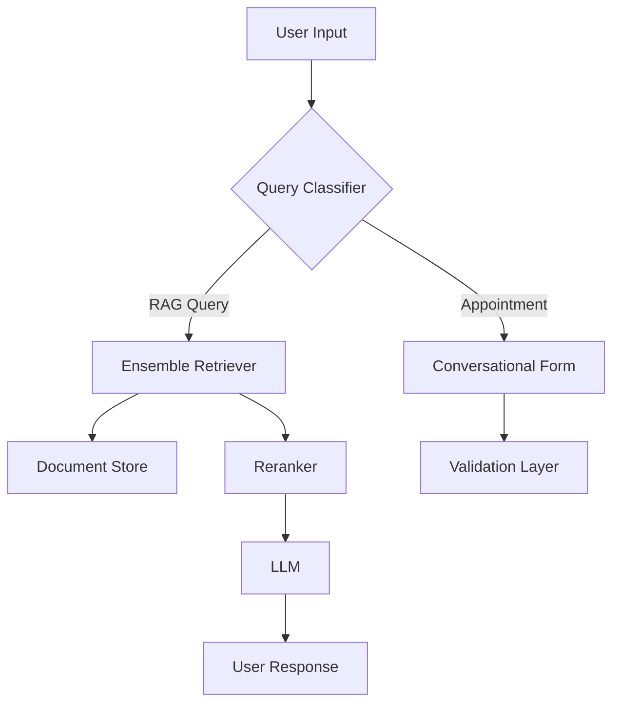

# RAG-Enabled Chatbot with Conversational Form Integration

A sophisticated chatbot implementation combining Retrieval-Augmented Generation (RAG) with conversational form capabilities. The system leverages ensemble retrieval methods, advanced reranking, and modular file processing.

## Architecture Components

### Core Technologies
- **LLM Integration**: 
  - Google Gemini
  - HuggingFace Models
- **Vector Database**: FAISS
- **Retrieval System**: Ensemble Retriever combining:
  - Keyword Similarity Retriever
  - Semantic Similarity Retriever
- **Reranking**: Cohere Reranker
- **Framework**: LangChain
- **Relational Databases**:
  - PostgreSQL
  - SQLite
  - Extensible to other LangChain-supported databases

### Document Processing

#### Supported File Formats
- PDF
- TXT
- JSON
- CSV
- HTML

Other files can be added easily, without much change as Factory concept is used.

#### Text Chunking Strategies
- RecursiveCharacterTextSplitting
- RecursiveJsonSplitting
- CharacterTextSplitting
- HTMLHeaderTextSplitting

The system automatically selects appropriate splitting methods based on file extensions through a factory pattern implementation.
We can explicitly pass the type of chunking method we want to apply also.

## Implementation Guide

### Prerequisites
1. Create and activate a Python virtual environment
2. Install dependencies:
   ```bash
   pip install -r requirements.txt
   ```
3. Configure API keys in `config.py`

### Core Functionality

#### RAG Implementation
- Utilizes BAAI/bge-base-en-v1.5 model for embeddings
- FAISS vector store for efficient similarity search
- Ensemble retrieval combining keyword and semantic approaches
- Cohere-powered reranking for improved result relevance

#### Conversational Form Features
- **Trigger Keywords**: "call me", "book me", "schedule", "book an appointment", etc which semantically represents appointent booking.
- **Information Collection**:
  - Required Fields: Name, Email, Date
  - Extensible field configuration
- **Validation Logic**:
  - Email format validation
  - Date parsing and validation:
    - Supports natural language date inputs (e.g., "next Sunday","tomorrow","day after tomorrow","Jan 2", etc)
    - Validates against current date
    - Converts relative dates to absolute timestamps


#### Appointment Booking Flow
1. User initiates with booking trigger phrase
2. Sequential information collection:
   - Name collection
   - Email collection with validation
   - Date collection with natural language parsing
3. Confirmation and storage of appointment details
4. Return to general RAG-based chat functionality

#### Query Processing
- Direct factual queries utilize RAG
- Unknown information handling with "I don't know" responses
- Context-aware conversation maintenance

### Error Handling
- Invalid email format detection and re-prompting
- Date validation with specific error messages
- Graceful exit handling with dedicated exit commands

## System Architecture Diagram


## Future Enhancements
- Additional file format support through factory pattern
- Enhanced validation rules
- Custom chunking strategies
- Additional database integrations
- Advanced appointment scheduling features


# RAG in PDF

This project demonstrates how to implement **Retrieval-Augmented Generation (RAG)** using different file formats, chunking methods, and conversational forms in a chatbot.

## Supported File Formats and Chunking Methods

The following file formats are supported along with their corresponding chunking methods:


## RAG with PDF

In this section, we show how to use **RAG** with a PDF file. For this example, I used my own CV in PDF format.

### Upload a PDF and Perform RAG

We will use the **Recursive Character Splitting** method with a chunk size of `1000` and margin `200`.

**PDF Provided:**


### Example 1: Query for Education

**Question Asked:** "Give me education of Prabigya"


### Example 2: Query for Skills and Projects

**Question Asked:** "Give me list of skills and projects of Prabigya"


### Appointment Booking via Chat

To invoke the conversational form for appointment booking, the user needs to type queries like "call me", "book me", "give me schedule", or "book an appointment".

**Question Asked:** "Call me for appointment"

Once triggered, the system collects user information including:
- Name
- Email
- Date

**Steps:**

1. **User Query:** Invocation of the conversational form
   

2. **User Information Collection:**
   - Name is asked
   - Email is asked

   **Email Validation:**
   If an incorrect email is entered, the user is prompted to re-enter the email.

   

   
   

3. **Date Collection for Appointment:**
   Once the email is validated, the system asks for the appointment date.

   **Converted Date:**
   If a natural language date is provided, it is converted into an actual date.

   

4. **Final Response:**
   Once all required fields are collected, the system returns a confirmation with all collected user data.

   

5. **Exit:**
   If the user submits an "exit" command, the chat session stops.

   

## RAG with TXT File

In this section, we show how to use **RAG** with a `.txt` file created from the Wikipedia text about **Laxmi Prasad Devkota**.

### File Used:


A **FAISS** vector database is created using the **BAAI/bge-base-en-v1.5** model. An ensemble method of keyword and semantic retrievers is used, and **Cohere AI** is used for reranking. 

### Example 1: Query for Laxmi Prasad Devkota's Birth

**Question Asked:** "When was Laxmi Prasad Devkota born? Summarize his political life."


### Example 2: Query for Wrong Literatures of Laxmi Prasad Devkota

**Question Asked:** "Give me the wrong literatures of Laxmi Prasad Devkota that caused war."

If the data is not available, the system responds with "I don't know."


### Example 3: Query for Poems of Laxmi Prasad Devkota

**Question Asked:** "List poems of him."


## Conclusion

This project demonstrates how RAG can be implemented in various formats like PDF, TXT,JSON, HTML, etc with conversational forms for collecting user information and answering queries based on the provided documents. The system uses advanced natural language processing techniques like semantic search, reranking, and entity extraction for a seamless experience.
