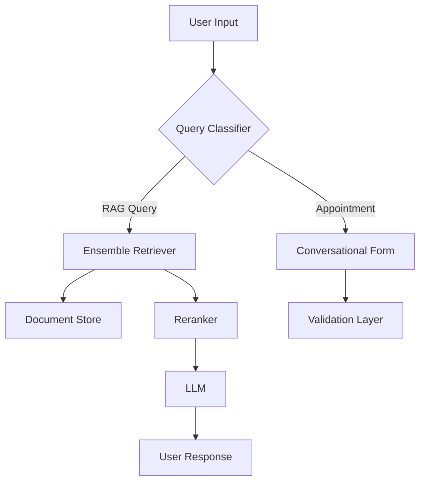

# RAG-Enabled Chatbot with Conversational Form Integration

A sophisticated chatbot implementation combining Retrieval-Augmented Generation (RAG) with conversational form capabilities. The system leverages ensemble retrieval methods, advanced reranking, and modular file processing.

## Architecture Components

### Core Technologies
- **LLM Integration**: 
  - Google Gemini
  - HuggingFace Models
- **Vector Database**: FAISS
- **Retrieval System**: Ensemble Retriever combining:
  - Keyword Similarity Retriever
  - Semantic Similarity Retriever
- **Reranking**: Cohere Reranker
- **Framework**: LangChain
- **Relational Databases**:
  - PostgreSQL
  - SQLite
  - Extensible to other LangChain-supported databases

### Document Processing

#### Supported File Formats
- PDF
- TXT
- JSON
- CSV
- HTML

Other files can be added easily, without much change as Factory concept is used.

#### Text Chunking Strategies
- RecursiveCharacterTextSplitting
- RecursiveJsonSplitting
- CharacterTextSplitting
- HTMLHeaderTextSplitting

The system automatically selects appropriate splitting methods based on file extensions through a factory pattern implementation.
We can explicitly pass the type of chunking method we want to apply also.

## Implementation Guide

### Prerequisites
1. Create and activate a Python virtual environment
2. Install dependencies:
   ```bash
   pip install -r requirements.txt
   ```
3. Configure API keys in `config.py`

### Core Functionality

#### RAG Implementation
- Utilizes BAAI/bge-base-en-v1.5 model for embeddings
- FAISS vector store for efficient similarity search
- Ensemble retrieval combining keyword and semantic approaches
- Cohere-powered reranking for improved result relevance

#### Conversational Form Features
- **Trigger Keywords**: "call me", "book me", "schedule", "book an appointment", etc which semantically represents appointent booking.
- **Information Collection**:
  - Required Fields: Name, Email, Date
  - Extensible field configuration
- **Validation Logic**:
  - Email format validation
  - Date parsing and validation:
    - Supports natural language date inputs (e.g., "next Sunday","tomorrow","day after tomorrow","Jan 2", etc)
    - Validates against current date
    - Converts relative dates to absolute timestamps

### Usage Examples

#### PDF Document Processing
```python
# Configuration for PDF processing
chunk_size = 1000
chunk_overlap = 200
splitting_method = RecursiveCharacterTextSplitting(
    chunk_size=chunk_size,
    chunk_overlap=chunk_overlap
)
```

#### Appointment Booking Flow
1. User initiates with booking trigger phrase
2. Sequential information collection:
   - Name collection
   - Email collection with validation
   - Date collection with natural language parsing
3. Confirmation and storage of appointment details
4. Return to general RAG-based chat functionality

#### Query Processing
- Direct factual queries utilize RAG
- Unknown information handling with "I don't know" responses
- Context-aware conversation maintenance

### Error Handling
- Invalid email format detection and re-prompting
- Date validation with specific error messages
- Graceful exit handling with dedicated exit commands

## System Architecture Diagram


## Future Enhancements
- Additional file format support through factory pattern
- Enhanced validation rules
- Custom chunking strategies
- Additional database integrations
- Advanced appointment scheduling features


## RAG in PDF

The following file formats are supported and their corresponding chunking methods.


ScreenShot:


Lets upload one pdf and check RAG.
We will be using Recursive Character splitting with chunk size=1000 and margin =200
I will be using my own CV for this.


ScreenShot:
Pdf_Provided:


Question Asked: Give me education of Prabigya


Question Asked: Give me list of skills and projects of Prabigya


### Now lets ask for appointment in the same chat
To invoke conversational form, user needs to enter quert like call me, book me, give me schedule, book an appointment, etc that semantically represents appointment booking.

Question Asked: call me for appointment

When this is called, chain to retrieve user information is called on its own.
Following field are collected:
Name, Email and Date-  Other can be added

validation for email and date are provided. When user provides invalid information 
(email or date), they are asked again to reenter that field.

For date: Dates in natural text are parsed to actual date. Correct date for terms like next Sunday, day after tomorrow, Jan 2, 2025 are parsed and if date of booking is less than present date, date is made invalid and user is asked again to reenter that field.

User info collecttions are asked untill all required fields are obtained. Then user can return to normal chat and use RAG(QA).

Steps:
1. User Query invokes conversational form in normal chat


2. User information collection questions are asked
i. Name is asked
ii. Email is asked


If wrong email is entered, another question saying incorrect email, give new email is asked.


iii. Once valid email is passed. Date to be scheduled for appointment is asked. 


User entered: Next Saturday in date question. The converted date is: 2025-1-4

After all user information is collected, AI returns final response indicating all user information collected.


If exit key is submitted. The chatting stops.


## RAG in txt file

A txt file is created about Laxmi Prasad Devkota by using the text available in Wikipedia.

File Used:


Vector database using BAAI/bge-base-en-v1.5 model, FAISS database is created. Retriver is made with ensemble method of keyword retriever and semantic retriever. Reranking is done with Cohere AI. RAG-QA chain, conversational form, classification chain are initialized and ready to operate.

Question Asked: When was Laxmi Prasad Devkota born? Summarize his political life.


Question Asked: Give me the wrong literatures of Laxmi Prasad Devkota that caused war.

If the data regarding question is not available in the provided file, it is clearly mentioned to LLM to return "I don't know" as its response in prompt.
SO we get desired result.


Question Asked: List poems of him.
